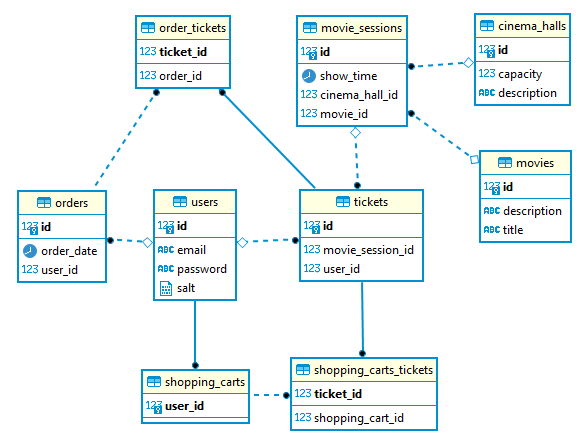

<p align="center">

</p>

<p align="center" style="font-size: 32px"> CINEMA-APP </p>

### Project description:

This is an application that represents the Cinema service. It is built using SOLID principles and implemented as such
functionalities such as authentication, registration, selection of all movies, user tickets, list of permitted movie theaters. With the ability to add new ones and delete them
users, tickets and movies. Interaction with the database implemented using `Hibernate`.

## Features 👀️:

- User find by email and create
- Authentication login and register
- Create cinema hall
- Create movie service
- Complete order
- Display all cinema hall, movie, user
- Login and Register

## Realization details

### The project uses the following architecture:

- Data access layer (DAO)
- Application layer (services)
- Security layer (security)

## Technologies that were used to create the service:

- MySQL or PostgreSQL
- Hibernate
- Maven

## 🚀️ Installation 🚀️

1. Type git clone, and then paste the URL you copied earlier.
   - `$ git clone https://github.com/DenysShl/cinema-app.git`
2. If your use MySql is there dependency for `pom.xml`  
below:
````xml
    <dependency>
        <groupId>mysql</groupId>
        <artifactId>mysql-connector-java</artifactId>
        <version>8.0.22</version>
    </dependency>
````

if you use PostgreSQL is so there dependency for `pom.xml`
below:

````xml
   <dependency>
       <groupId>org.postgresql</groupId>
       <artifactId>postgresql</artifactId>
       <version>42.3.5</version>
   </dependency>
````
3. By default, `hibernare.cfg.xml` is configured for PostgreSQL, but if you want to use MySQL, then you need to change the `hibernate.cfg.xml` file as follows: 
```
   <property name="dialect">org.hibernate.dialect.MySQL5Dialect</property>
   <property name="connection.url">jdbc:mysql://localhost:3306/ticket_app?serverTimeZone=UTC</property>
   <property name="connection.driver_class">com.mysql.cj.jdbc.Driver</property>
```
4. Run `Maim.class`
### _Database structure_


